## Testing 

## Table of Contents
--------------------------------------

 

- [Testing Strategy](#testing-strategy)
- [User story testing](#user-story-testing)
- [Validator Testing](#validator-testing)
- [Manual Testing](#manual-testing)
- [Bugs](#bugs)

------

 

## Testing Strategy

 

 

- I decided on a manual testing strategy for the development of the site. I did this to ensure the website is user-friendly and check issues with navigation, layout, and usability that may not be apparent through automated testing.

 

------------

 

 

## User Story Testing

 
 

#### Epic 1: User Register
-----------

 

#### User story 1: Sign-up

 

> As a site user I can sign-up so that I use the website
- Acceptance Criteria 1: Given when I click the register button, then the website displays the register form.
- Acceptance Criteria 2: Given when I fill out a username and password, then I have an account on website.

### All tests passed

----------

 

### User story 2:  User Login

 

> As a site user I can login into my account so that use the website
- Acceptance Criteria 1: Given when I click the login button, then the website displays the login form.
- Acceptance Criteria 2: Given when I fill in my username and password, then I can login into my existing account.

### All tests passed

----------

 

### User story 3:  User Logout
 

> As a site user I can logout of my account so that I can stop using website features.
- Acceptance Criteria 1: Given when I click the logout button, then the website displays the logout page.
- Acceptance Criteria 2: Given when I click the signout button, then my account is logged out.

### All tests passed

----------

 

### Epic 2: CRUD
--------

 

###  User story 4: See expenses
 

>As a site user I can see my expenses that were added so that track my spending
- Acceptance Criteria 1: Given when I view expenses main page, then the website displays all my expenses.

### All tests passed

----------

 

### User story 5: Add expenses
 

>As a site user I can see my expenses that were added so that I keep track of all expenses
- Acceptance Criteria 1: Given when I click the add expense button, then the website displays the  add expense form
- Acceptance Criteria 2: Given when I submit the form, then the expense is diplayed.

### All tests passed

----------

 

### User story 6:  Update expenses 
 

>As a site user I can edit an expense so that I make changes to my expenses
- Acceptance Criteria 1: Given when I click the edit expense button, then the website displays the edit expense form.
- Acceptance Criteria 2: Given when I click the submit button, then the expense is updated.

### All tests passed

----------

 

###  User story 7: Delete expenses
 

>As a site user I can delete an expense so that I delete an expense that I dont want
- Acceptance Criteria 1: Given when I click the delete expense button, then the expense is removed from expenses page

### All tests passed

----------

 

## Validator testing
 

----------

 

## Python pep 8

 

All the custom Python code was was tested manually thoughout the project and with the following pep8 validator.

 
 

### views.py 
 

- Test passed

 

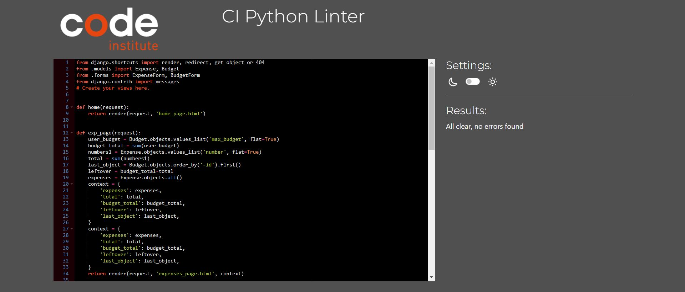

 

---------------------
 

### models.py 

 

- I left these line length errors as they dont affect readability

 

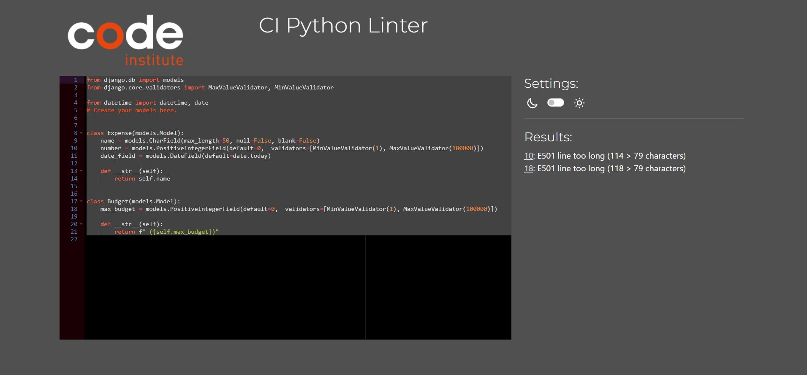

 

---------------------
 

### urls.py (app)

 

- Test passed

 

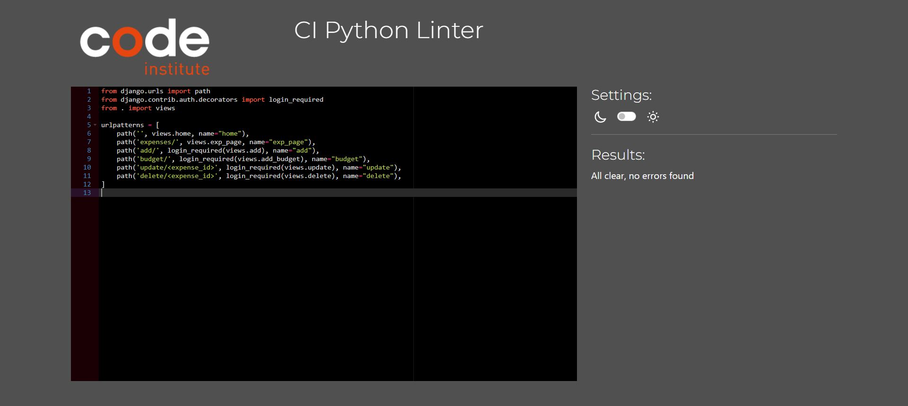

 

---------------------

 

### urls.py (project)

 

- Test passed

 

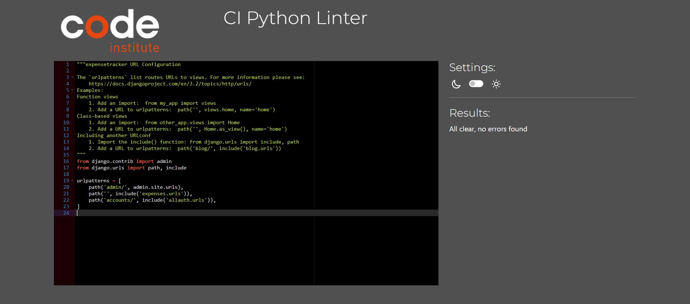

 

---------------------

 

### forms.py 

 

- Test passed

 

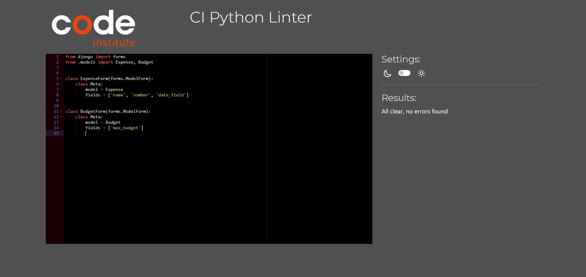

 

---------------------
 

### settings.py 

 

- I left these errors as they dont affect readability

 

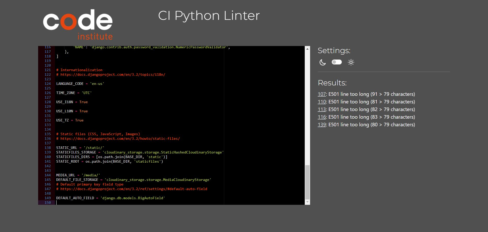

 

---------------------

 
 

## Jshint

 
 

### main.js 

 

- Test passed

 

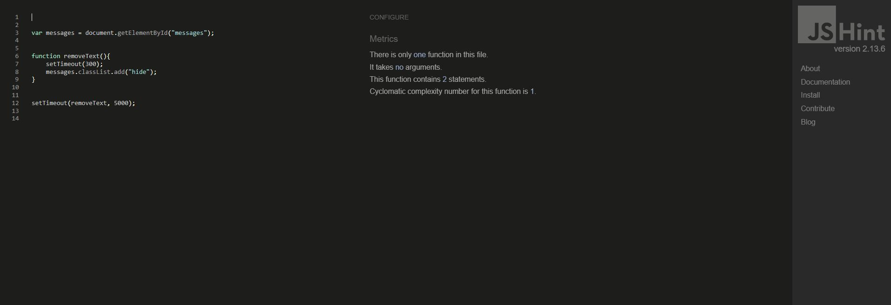

 

----------------

 

 

## WC3 HTML Validatior

 

--------------

 

### home_page.html

 

- Test passed

 

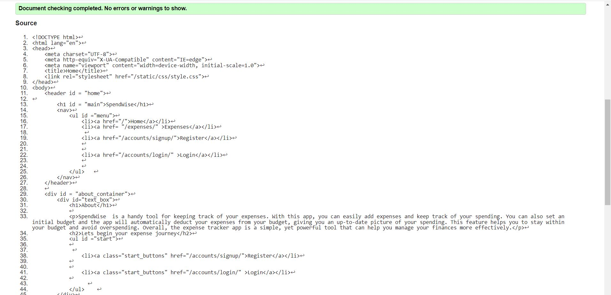

 

---------------------
 

### expenses_page.html

 

- Test passed

 

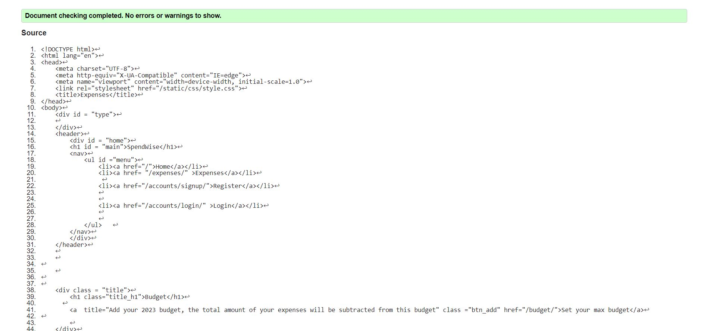

 

--------

 

 

## WC3 CSS Validatior

 

-------

 

### style.css

 

- Test passed

 

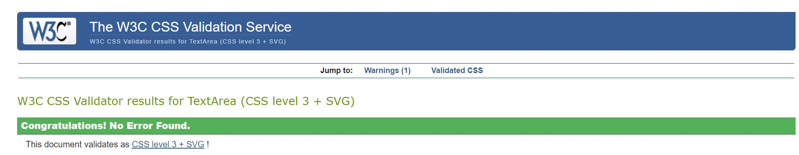

 

---------------------

 
 

## Light house testing

----------

 

- Main pages

 

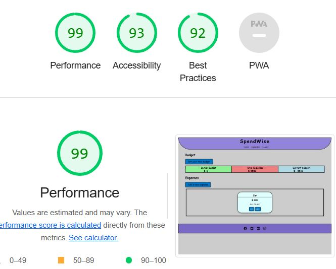

 

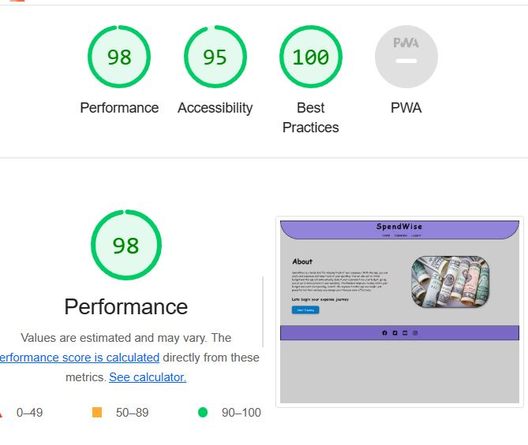

 

------------------

 

 

## Manual Testing

 

----
 

### Site responsiveness

 

- I manually tested the responsiveness of the website on many devices. I used Chrome DevTools to simulate different screen sizes also. I made sure there were not significant issues such as overlapping text, images not scaling properly, and buttons that are difficult to click. 

 

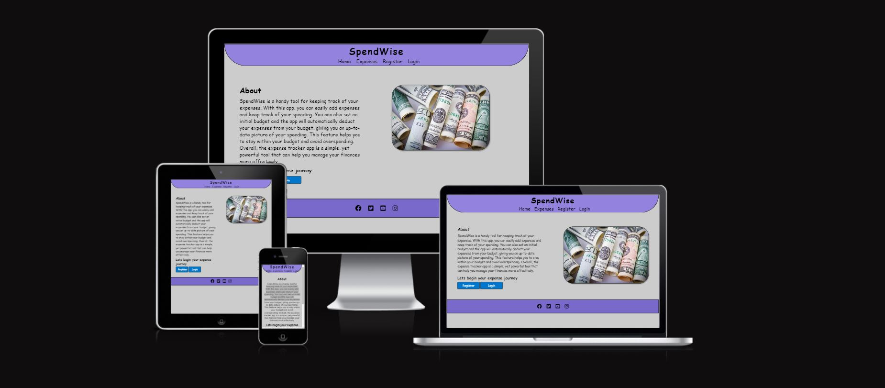

 

---------

 

### Browser compatiabiliy 

 

- I checked that the website worked in the following browsers: Google Chrome, Mozilla Firefox, Apple Safari, Microsoft Edge. 

 

-------

## Bugs

 

- Sometimes, the user will get a 404 page error when they try to delete an expense. To reproduce the bug, the user needs to delete a large number of expense items. 

 

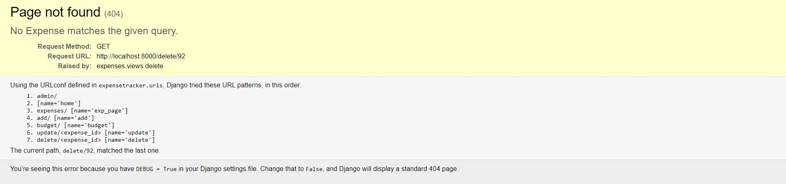

 

-------

 

